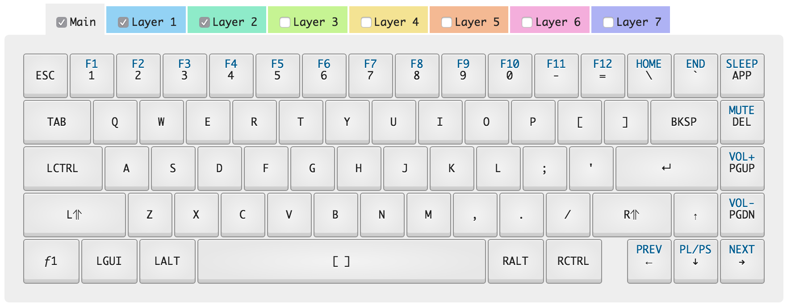

# WhiteFox Keyboard Configuration

Keyboard is [Matt3o's WhiteFox](https://input.club/whitefox), mine is in the True Fox layout option.

## Installation:
1. Create/modify configuration on [WhiteFox configurator)(https://input.club/configurator-whitefox)
2. Load firmware with [dfu-util](https://github.com/kiibohd/controller/wiki/Loading-DFU-Firmware)

